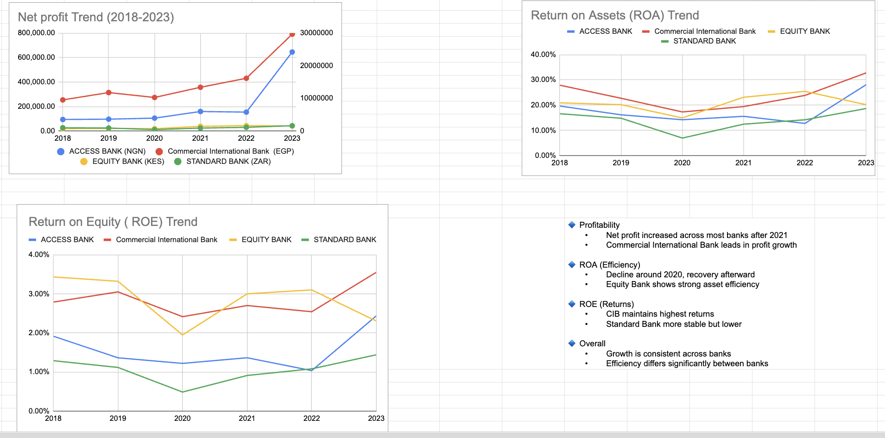

📊 African Bank Financial Performance Analysis (2018–2023)

📌 Overview

This project analyzes the financial performance of selected African banks from 2018 to 2023 using key metrics such as revenue, net profit, total assets, and efficiency ratios (ROA & ROE).
## 📊 Project Workflow

1. Data Collection – Gathered financial data of selected African banks (2018–2023)
2. Data Cleaning – Organized raw dataset in Google Sheets
3. Data Analysis – Created pivot tables for:
   - Net Profit
   - Return on Assets (ROA)
   - Return on Equity (ROE)
4. Data Visualization – Built charts to show trends and comparisons
5. Insights – Extracted key performance patterns across banks
   
⸻

🎯 Objectives
	•	Analyze revenue and profitability trends
	•	Compare financial performance across banks
	•	Evaluate efficiency using ROA and ROE
	•	Identify growth patterns and performance gaps

⸻

🛠️ Tools Used
	•	Google Sheets
	•	Excel
	•	Data Visualization (Charts)

⸻
## 📁 Project Structure

- africa bank analysis.xlsx → Raw dataset
- Dashboard.png → Visualization dashboard
- README.md → Project documentation
- 
📈 Key Insights

- 📈 Profitability: Net profit increased significantly after 2021 across most banks, with Commercial International Bank leading growth.
- ⚙️ Efficiency (ROA): Decline observed around 2020, followed by recovery; Equity Bank shows strong asset utilization.
- 💰 Returns (ROE): Commercial International Bank consistently delivers the highest returns, while Standard Bank remains stable but lower.
- 📊 Overall: Growth trend is consistent across banks, but efficiency varies significantly between institutions.
-
-
-    
  📊 Dashboard Overview

The dashboard presents:
- Net Profit trends (2018–2023)
- Return on Assets (ROA)
- Return on Equity (ROE)

It highlights performance differences across selected African banks.

🛠 Skills Demonstrated

- Data Cleaning & Preparation
- Pivot Table Analysis
- Financial Ratio Analysis (ROA, ROE)
- Data Visualization
- Insight Generation & Storytelling
